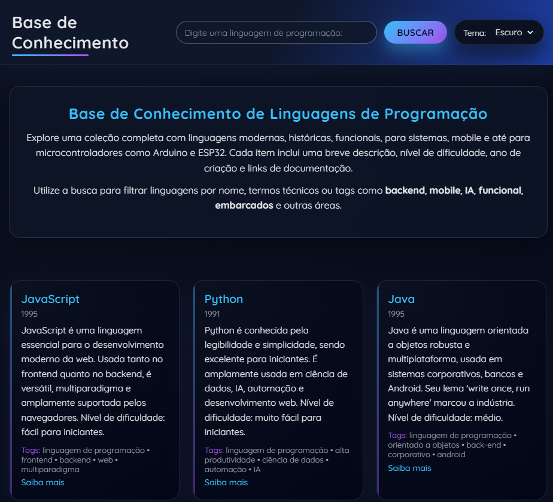
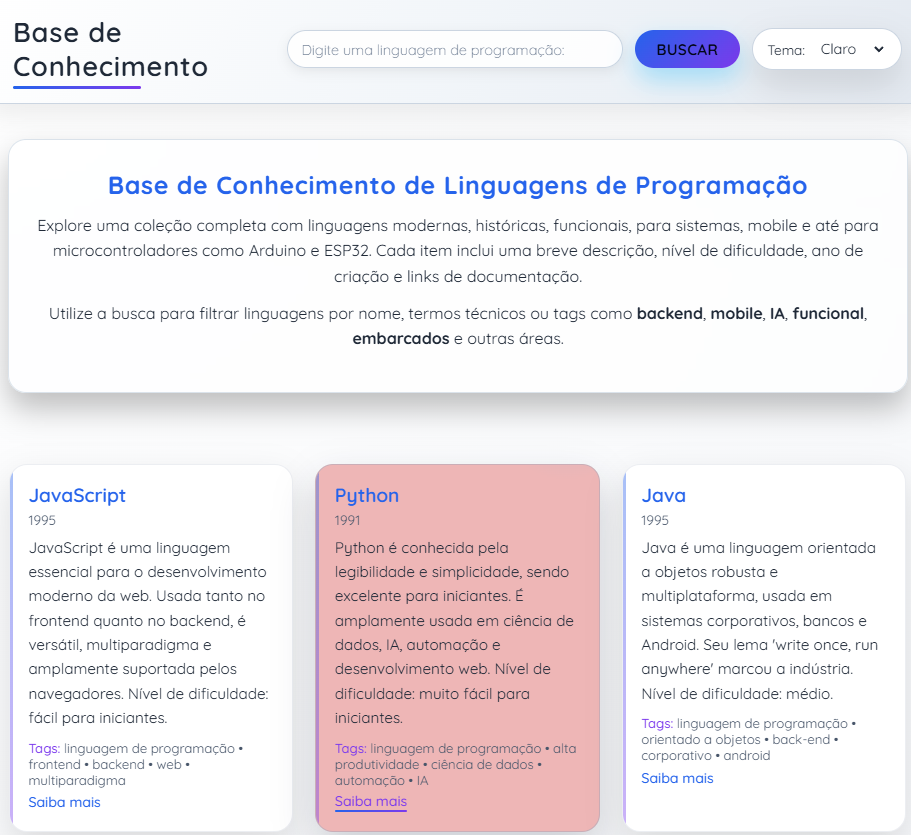

📘 Base de Conhecimento — Linguagens de Programação

Uma aplicação web interativa criada para explorar linguagens de programação de maneira simples, intuitiva e moderna.
Permite filtrar tecnologias, visualizar informações detalhadas e alternar entre tema escuro e claro.

 
🚀 Tecnologias Utilizadas

HTML5 
CSS3 (gradientes, animações, responsividade, dark/light theme) 
JavaScript (DOM, eventos, fetch, filtro inteligente) 
JSON (fonte de dados) 

 
🎯 Objetivo do Projeto

Este projeto foi desenvolvido para estudo, prática e aperfeiçoamento em:
Manipulação do DOM
Filtragem de dados
Estilização avançada (CSS moderno)
Uso de JSON como fonte externa
Organização de código
Interação com usuário
Temas claro/escuro

 
🧠 Funcionalidades
 
 
🔍 Busca Inteligente 

O usuário pode pesquisar por:
nome da linguagem
conteúdo da descrição
tags (ex: backend, mobile, IA, embarcados...)
A busca funciona pressionando ENTER ou clicando em Buscar.

 
🎨 Tema Escuro e Claro 

O projeto contém um seletor no header:

Tema Escuro (padrão) 
Tema Claro 

A interface inteira troca de cores através de CSS Variables, oferecendo transições suaves e visual profissional.

 
🗂️ Cards Dinâmicos 

Os cards são montados automaticamente via JavaScript, com:

Destaques coloridos
Descrição
Ano de criação
Tags
Link “Saiba mais”

 
🧩 Arquitetura limpa
 
Arquivos principais: 
index.html — estrutura da página 
style.css — estilos, temas, animações 
script.js — busca, renderização dos cards, tema 
data.json — base de dados com as linguagens 

 
🖥️ Pré-requisitos 

Nenhum.
Basta abrir o arquivo index.html no navegador.

Para edição, recomenda-se: 
VSCode 
Live Server 
Git + GitHub 

 
▶️ Como Rodar o Projeto 

Clone o repositório:
git clone https://github.com/SEU-USUARIO/base-de-conhecimento.git

Acesse a pasta:
cd base-de-conhecimento

Abra no navegador:
index.html

Se usar VSCode, você pode rodar com Live Server. 

📁 Estrutura do Projeto 
📂 base-de-conhecimento 
├── index.html 
├── style.css 
├── script.js 
└── data.json 

 
📷 Prévia do Projeto 

 

👨‍💻 Autor

Sérgio Rodrigues 
Projeto desenvolvido para estudos de HTML, CSS, JavaScript e estruturação de interfaces modernas.
